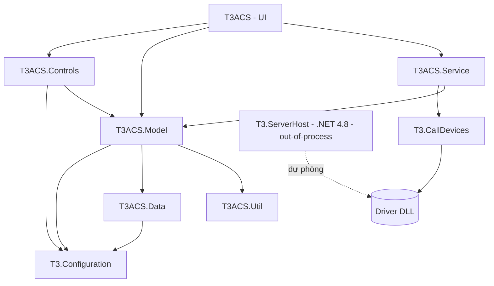
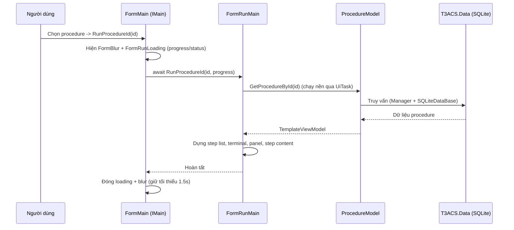

# 03. Kiến trúc & thiết kế kỹ thuật

> Tài liệu này mô tả kiến trúc thực tế của T3ACS dựa trên mã nguồn hiện tại.
> Cập nhật khi cấu trúc project hoặc luồng xử lý thay đổi.

## 3.1. Tổng quan

T3ACS là ứng dụng **desktop .NET 8 Windows Forms** dùng để tạo, quản lý và **chạy các
Procedure** (quy trình kiểm thử/đo lường) trên thiết bị **DUT (Device Under Test)**. Ứng
dụng gọi tới thiết bị đo thông qua các **driver DLL nạp động** và lưu dữ liệu vào **SQLite**.

Kiến trúc phân lớp: **UI → Service → Model → Data**, cùng lớp gọi thiết bị **`T3.CallDevices`**
và lớp cấu hình nền **`T3.Configuration`**.

## 3.2. Danh sách project & trách nhiệm

| Project | Loại | Target | Trách nhiệm |
|---------|------|--------|-------------|
| `T3ACS` | WinExe (UI) | net8.0-windows | Giao diện WinForms: form chính, chạy procedure, tạo/sửa step, quản lý DUT/User. `FormMain` hiện thực `IMain`. |
| `T3ACS.Controls` | Library (UI) | net8.0-windows | Control/bảng dùng lại (Table, Row, progress bar, popup chọn step…). |
| `T3ACS.Service` | Library | net8.0-windows | Tầng nghiệp vụ hướng UI: điều phối gọi thiết bị, xuất báo cáo, gọi tool. `FormService`/`FormMainService`. |
| `T3ACS.Model` | Library | net8.0-windows | Business model (`ProcedureModel`, `DUTModel`, `UserModel`…), ViewModel/DTO, hằng số (`StepTypeName`, `StepFunctionName`, `VariableType`). |
| `T3ACS.Data` | Library | net8.0-windows | Truy cập SQLite: `SQLiteDataBase` (`IDataBase`) + các Manager (`ProcedureManager`, `DUTManager`, `UserManager`, `PackageManager`, `ProcedureDetailManager`, `ConfigurationManager`). |
| `T3.CallDevices` | WinExe | net8.0-windows | Nạp động driver DLL và gọi hàm thiết bị (`T3Call`, in-process). Đồng thời là host thiết bị dự phòng (`StartSeverT3`, `T3Client`). |
| `T3.Configuration` | Library | net8.0-windows | Cấu hình nền: `Main` (đường dẫn, connection string), `Registry`, `ThemeManager`, `Logger`, interface `IMain`. |
| `T3ACS.Util` | Library | net8.0-windows | Tiện ích dùng chung. |
| `T3.ServerHost` | WinExe | **.NET FW 4.8** | Host thiết bị **out-of-process** (named pipe), đường dự phòng — hiện app chưa dùng. |
| `T3ACS.FormService` | Library | net8.0-windows | Biến thể service (chỉ tham chiếu Model) — legacy/thử nghiệm. |

## 3.3. Sơ đồ phụ thuộc giữa các project

Nguyên tắc: **phụ thuộc một chiều từ trên xuống**. UI không truy cập trực tiếp `T3ACS.Data`;
mọi truy cập DB đi qua `T3ACS.Model`. Việc gọi thiết bị đi qua `T3ACS.Service → T3.CallDevices`.

## 3.4. Chi tiết từng tầng

### UI (`T3ACS`, `T3ACS.Controls`)
- `FormMain` là form chính, hiện thực `IMain` (`RunProcedureId`, `EditProcedureId`,
  `CreateProcedure`, `ClearFormMain`…).
- `FormRunMain` chịu trách nhiệm **chạy một procedure**: nạp dữ liệu, dựng danh sách step,
  terminal log, panel thông tin, và các form đánh giá theo từng loại step (`StepDefault/*`).
- Quy tắc bất động UI: việc **nặng/thuần dữ liệu** (đọc DB, gọi thiết bị) được đẩy ra thread
  nền qua `UiTask.RunAsync`; **không** thao tác control WinForms trong `work`, chỉ cập nhật UI
  sau `await`.

### Service (`T3ACS.Service`)
- `IFormService`/`FormService`: `CallFunction`, `CallFunctionLoad`, `CallFunctionSave`,
  `CallFunctionStop`, `ExportReport`. Điều phối lời gọi tới driver qua `T3Call.Instance`.
- `IFormMainService`/`FormMainService`: phục vụ form chính (tools, extension).

### Model (`T3ACS.Model`)
- **Business Model** (`ProcedureModel`, `DUTModel`, `UserModel`, `PackageModel`): logic nghiệp
  vụ, gọi xuống các Manager của `T3ACS.Data`. Ví dụ `ProcedureModel.GetProcedureById(id)`,
  `InsertResultProcedure(vm)`.
- **ViewModel/DTO** (`TemplateViewModel`, `ProcedureViewModel`, `TableProcedureViewModel`,
  `DUTViewModel`…): truyền dữ liệu giữa các tầng, serialize JSON (Newtonsoft.Json).
- **Constants**: `StepTypeName`, `StepFunctionName`, `VariableType`.

### Data (`T3ACS.Data`)
- `SQLiteDataBase : IDataBase` — bao bọc `Microsoft.Data.Sqlite`:
  - Kết nối lấy từ `Main.ConnectionStringSQLite` (`T3.Configuration`).
  - **Truy vấn tham số hoá** (`ExecuteInsert/ExecuteNonQuery/GetDataTableParam/GetObject` với
    `Dictionary<string,object>`) — chống SQL injection; Manager nên dùng các overload này.
  - **Transaction dùng chung** (ambient): `BeginTransaction/Commit/Rollback` — mọi lệnh param
    chạy trên cùng connection khi transaction đang mở.
  - Lỗi ở `GetDataTable` được ghi qua `Logger.Log` thay vì ném ra ngoài (giữ hành vi cũ).
- **Manager**: mỗi bảng/nhóm nghiệp vụ một manager (Procedure, ProcedureDetail, DUT, User,
  Package, Configuration).

### Configuration (`T3.Configuration`)
- `Main`: đường dẫn ứng dụng, connection string SQLite, tham số toàn cục.
- `Logger`: ghi log lỗi. `ThemeManager`/`Registry`: chủ đề & thiết lập.
- `IMain`: hợp đồng giữa các form phụ và form chính.

## 3.5. Luồng chạy một Procedure (Run)

Điểm quan trọng:
- `FormMain.RunProcedureId` (async void, khớp `IMain`) mở **FormBlur** (mờ nền) + **FormRunLoading**
  (progress/status), bảo đảm hiển thị **tối thiểu 1.5s** để tránh nháy, và luôn đóng trong `finally`.
- `FormRunMain.RunProcedureId(id, IProgress)` báo tiến trình theo mốc 10/60/80/100%.

## 3.6. Cơ chế gọi thiết bị & nạp driver (Plugin loading)

App **gọi thiết bị in-process** qua `T3ACS.Service → T3.CallDevices.T3Call.Instance.CallFunction`.
`T3Call` nạp driver DLL bằng đường dẫn, cache theo path, phản chiếu (reflection) type, tạo
instance và `Invoke` method.

Cơ chế nạp assembly được thiết kế theo **mô hình PluginManager của OpenTAP** để ổn định:
- **Chuẩn hoá đường dẫn** (`Path.GetFullPath`, so sánh `OrdinalIgnoreCase`) → tránh nạp trùng.
- **Nạp vào một context duy nhất** (`AssemblyLoadContext.Default.LoadFromAssemblyPath` trên .NET 8;
  `Assembly.LoadFrom` trên .NET 4.8) → không lệch identity type.
- **Resolver trung tâm** (`AssemblyLoadContext.Default.Resolving` + `AppDomain.AssemblyResolve`)
  dò dependency trong tập thư mục của mọi driver đã nạp; ưu tiên assembly đã nạp sẵn (dedup theo tên).
- **An toàn đa luồng** (`lock`), **bọc lỗi kèm ngữ cảnh** DLL/type/method.

> Ghi chú unload: giống OpenTAP, driver **không unload trong tiến trình** vì trả về object sống
> (ví dụ `Form`) nhúng trong UI. Muốn reload driver mà không tắt app: định tuyến qua host
> out-of-process `T3.ServerHost` rồi restart host (cơ chế đã có: `StartSeverT3`, `T3Client`).

Tài liệu chi tiết loader: xem `T3.CallDevices/T3Call.cs` và `T3.ServerHost/T3Server.cs` (class `PluginLoader`).

## 3.7. Lưu trữ dữ liệu (SQLite)

- File DB xác định bởi `Main.ConnectionStringSQLite`.
- Nhóm dữ liệu chính (theo Manager): **Procedure / ProcedureDetail** (quy trình & bước),
  **DUT** (thiết bị kiểm), **User** (người dùng/phân quyền), **Package**, **Configuration**.
- Kết quả chạy procedure được lưu qua `ProcedureModel.InsertResultProcedure` (có serialize JSON).

> TODO: Bổ sung lược đồ ERD chi tiết (bảng, khoá chính/ngoại) — xem `docs/images/erd.png`.

## 3.8. Quyết định kiến trúc (ADR) — tóm tắt

| Quyết định | Lý do |
|-----------|-------|
| Phân lớp UI→Service→Model→Data một chiều | Tách trách nhiệm, dễ kiểm thử/bảo trì. |
| Nạp driver in-process + resolver kiểu OpenTAP | Ổn định, đúng identity type; đủ cho nhu cầu hiện tại. |
| Không unload driver in-process | Driver trả object sống; unload không an toàn (giống OpenTAP). |
| Truy vấn tham số hoá + transaction ambient | Chống injection; đảm bảo nhất quán cho thao tác nhiều bước. |
| Đẩy việc nặng ra thread nền (`UiTask`) | Tránh treo UI ("Not Responding"). |

## 3.9. Rủi ro & giới hạn đã biết
- Resolver dò dependency theo **tên đơn**, chưa lọc version/culture; nếu 2 driver cần 2 version
  khác nhau của cùng dependency, mô hình 1-context sẽ chọn 1 version.
- `T3.ServerHost` ở .NET Framework 4.8 (khác runtime với phần còn lại) — cần MSBuild để build.
- `T3ACS.FormService` trùng vai trò với `T3ACS.Service` — cần xác định giữ hay bỏ.

> TODO: Bổ sung ERD, sequence chi tiết cho luồng Save/Stop/Export, và sơ đồ triển khai.
