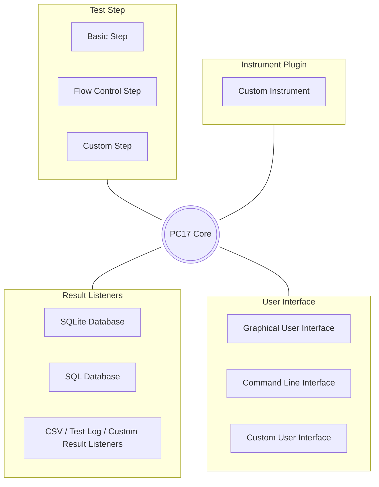
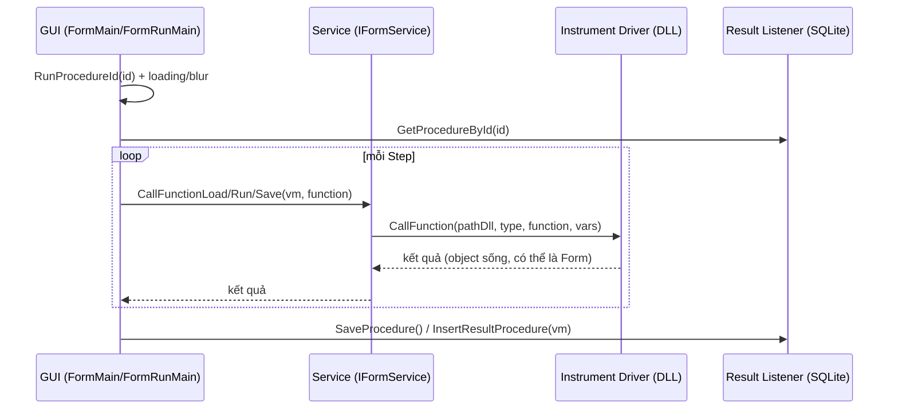

# PC17 — Software Design Document (SDD)

| | |
|---|---|
| **Sản phẩm** | PC17 — Nền tảng tự động hoá kiểm thử/đo lường phần cứng (DUT) |
| **Bản triển khai hiện tại** | Solution `T3ACS` (.NET 8 Windows Forms) |
| **Phiên bản tài liệu** | 0.1 (bản nháp) |
| **Ngày** | 2026-08-19 |
| **Trạng thái** | Draft — mô tả thiết kế + hiện trạng cài đặt |

> Tài liệu này là **thiết kế tổng thể** của PC17, dựa trên *Sơ đồ phân rã mức 0*
> (`Sơ đồ phân rã mức 0.drawio`) và mã nguồn hiện tại. Chi tiết mức project/layer xem thêm
> [`03-Kien-truc-thiet-ke.md`](03-Kien-truc-thiet-ke.md).

---

## 1. Giới thiệu

### 1.1. Mục đích
PC17 là nền tảng cho phép **định nghĩa, quản lý và thực thi các quy trình kiểm thử/đo lường
(Procedure)** trên thiết bị **DUT (Device Under Test)**, với khả năng **mở rộng bằng plugin**:
thêm loại bước kiểm (Test Step), thêm thiết bị đo (Instrument), thêm nơi ghi kết quả
(Result Listener) và thêm giao diện (User Interface) mà không phải sửa lõi.

Mô hình kiến trúc lấy cảm hứng từ **PluginManager của OpenTAP**: một **Core** nhỏ ở trung tâm,
bao quanh bởi các **nhóm plugin** nạp động.

### 1.2. Phạm vi
- **Trong phạm vi:** lõi thực thi procedure/step, nạp plugin động, lưu kết quả, giao diện đồ hoạ.
- **Ngoài phạm vi (định hướng tương lai):** CLI đầy đủ, SQL Server làm Result Listener, custom
  UI của bên thứ ba (xem §9 Roadmap).

### 1.3. Thuật ngữ
| Thuật ngữ | Ý nghĩa |
|-----------|---------|
| DUT | Device Under Test — thiết bị được kiểm |
| Procedure | Quy trình kiểm thử gồm nhiều Step, có thứ tự |
| Step | Một bước trong procedure (Number, Boolean, Correction, Report…) |
| Instrument | Thiết bị đo; điều khiển qua driver DLL nạp động |
| Result Listener | Nơi nhận & lưu kết quả (SQLite, CSV, log…) |
| Plugin | Thành phần nạp động (Step/Instrument/Result Listener/UI) |
| PC17 Core | Lõi điều phối: nạp plugin, chạy procedure, phát kết quả |

### 1.4. Tài liệu tham chiếu
- `Sơ đồ phân rã mức 0.drawio` — sơ đồ phân rã mức 0.
- `03-Kien-truc-thiet-ke.md` — kiến trúc chi tiết theo project/layer.
- Mã nguồn: `T3.CallDevices/T3Call.cs`, `T3ACS/FormRunMain.cs`, `T3ACS.Data/*`.

---

## 2. Cân nhắc thiết kế (Design considerations)

### 2.1. Giả định
- Chạy trên Windows, .NET 8 Desktop Runtime.
- Driver/plugin được biên dịch sẵn thành DLL .NET, đặt trong thư mục biết trước.
- Mỗi lần chạy phục vụ một trạm đo (single-operator), không đa người dùng đồng thời trên cùng tiến trình.

### 2.2. Ràng buộc
- Giữ **kiến trúc phân lớp** hiện tại (UI → Service → Model → Data) và lớp thiết bị `T3.CallDevices`.
- Không phụ thuộc OpenTAP (chỉ mượn ý tưởng kiến trúc).
- Định danh code tiếng Anh; tài liệu/comment tiếng Việt.

### 2.3. Yêu cầu phi chức năng (NFR)
| Thuộc tính | Mục tiêu thiết kế |
|-----------|-------------------|
| Ổn định | Nạp plugin không làm sập lõi; resolver dò dependency; bọc lỗi có ngữ cảnh |
| Đáp ứng UI | Việc nặng chạy nền (`UiTask`), UI không "Not Responding" |
| Khả mở rộng | Thêm Step/Instrument/Result Listener/UI qua plugin, không sửa Core |
| Toàn vẹn dữ liệu | Truy vấn tham số hoá + transaction cho thao tác nhiều bước |
| Truy vết | Logging tập trung (`Logger`), lỗi kèm tên DLL/type/method |

---

## 3. Kiến trúc tổng thể — Phân rã mức 0

### 3.1. Sơ đồ phân rã mức 0

### 3.2. Trách nhiệm PC17 Core
Core là "kernel" điều phối, gồm 4 nhiệm vụ:
1. **Plugin management** — phát hiện & nạp động Step/Instrument/Result Listener/UI.
2. **Procedure execution** — chạy tuần tự các step, điều khiển luồng (Next/Back/jump/Stop).
3. **Instrument access** — trung gian gọi tới thiết bị qua driver.
4. **Result dispatch** — phát kết quả tới các Result Listener và lưu trữ.

### 3.3. Ánh xạ khái niệm ↔ cài đặt hiện tại & trạng thái

| Thành phần (mức 0) | Cài đặt trong code | Trạng thái |
|--------------------|--------------------|-----------|
| **PC17 Core** | `FormRunMain` (điều phối chạy) + `ProcedureModel` + `T3ACS.Service` + `T3.CallDevices.T3Call` | ☑ Có |
| **Test Step → Basic** | `StepDefault/*` (Number, String, Boolean, FileAttach, Correction, Calculate, DUTInformation…) theo `StepTypeName` | ☑ Có |
| **Test Step → Flow Control** | Điều hướng step (Next/Back/nhảy tới step, `RequiresPreviousStep`) | ◑ Một phần |
| **Test Step → Custom** | `CustomStep/*`, `FormCustomStepPopup`, `CreateStep/*` | ☑ Có |
| **Instrument Plugin → Custom Instrument** | Driver DLL nạp qua `T3Call.CallFunction` (hợp đồng `LoadView/Prepare/Run/SaveData/Stop`) | ☑ Có |
| **Result Listeners → SQLite** | `T3ACS.Data` (`SQLiteDataBase` + Manager), `ProcedureModel.InsertResultProcedure` | ☑ Có |
| **Result Listeners → SQL Database** | — | ○ Kế hoạch |
| **Result Listeners → CSV / Test Log / Custom** | Xuất báo cáo `IFormService.ExportReport` (EPPlus/Excel); Test Log (`FormShowLog`) | ◑ Một phần |
| **User Interface → GUI** | `T3ACS` WinForms (`FormMain`…) | ☑ Có |
| **User Interface → CLI** | — (host pipe `T3.ServerHost` không phải CLI) | ○ Kế hoạch |
| **User Interface → Custom UI** | Cơ chế Tools/Extension (`CallTool`, `FormManagerExtension`) | ◑ Một phần |

> ☑ Có · ◑ Một phần · ○ Kế hoạch

### 3.4. Ánh xạ sang các project (bản cài đặt T3ACS)
PC17 Core được hiện thực rải trên các project theo tầng (chi tiết ở `03-Kien-truc-thiet-ke.md`):
`T3ACS` (UI/GUI) → `T3ACS.Service` (điều phối) → `T3ACS.Model` (business + ViewModel) →
`T3ACS.Data` (Result Listener SQLite); `T3.CallDevices` (Instrument/plugin loader);
`T3.Configuration` (cấu hình nền); `T3.ServerHost` (host thiết bị out-of-process, dự phòng).

---

## 4. Thiết kế thành phần (Component design)

### 4.1. PC17 Core — Procedure Execution Engine
- **Đầu vào:** `procedureId`. **Ra:** kết quả từng step + bản ghi kết quả procedure.
- Luồng: `FormMain.RunProcedureId(id)` → `FormRunMain.RunProcedureId(id, IProgress)` →
  `ProcedureModel.GetProcedureById(id)` (chạy nền) → dựng UI theo step → chạy từng step.
- Trạng thái chạy: `_statusAction`, `CurrentStep`; điều hướng `NextStep`, quay lại, nhảy step.
- Lưu kết quả: `SaveProcedure(done)` → `ProcedureModel.InsertResultProcedure` (serialize JSON).

### 4.2. Test Step
- **Basic Step:** mỗi loại có form đánh giá trong `StepDefault/*`, chọn theo `StepTypeName`.
- **Flow Control Step:** logic điều hướng trong `FormRunMain` (điều kiện bước trước — `RequiresPreviousStep`).
- **Custom Step:** người dùng tự định nghĩa (`CustomStep/*`), hoặc step gọi hàm driver ngoài.
- **Điểm mở rộng:** một step "động" ánh xạ tới `(pathDll, functionType, functionName)` và được
  Core gọi qua Service → `T3Call`.

### 4.3. Instrument Plugin
- Thiết bị được điều khiển bằng **driver DLL .NET** nạp động.
- **Hợp đồng plugin** (theo `StepFunctionName`): `LoadView`, `Prepare`, `Run`, `SaveData`, `Stop`.
  Core gọi các hàm này qua `IFormService.CallFunction*` → `T3Call.CallFunction`.
- Cơ chế nạp: xem §7.

### 4.4. Result Listeners
- **SQLite (chính):** `T3ACS.Data` — bảng Procedure/ProcedureDetail/DUT/User/Package/Configuration.
- **CSV / Report:** `ExportReport(ext, vm)` sinh báo cáo (EPPlus).
- **Test Log:** `FormShowLog` hiển thị nhật ký chạy; lưu vào bản ghi kết quả.
- **Mở rộng:** thiết kế cho phép thêm listener (SQL Server, custom) — chưa cài đặt.

### 4.5. User Interface
- **GUI:** WinForms (`FormMain` là shell, hiện thực `IMain`).
- **Tools/Custom UI:** nạp tool ngoài trả về `Form` và hiển thị (`CallTool`).
- **CLI:** định hướng tương lai.

---

## 5. Thiết kế dữ liệu (Data design)

### 5.1. Lưu trữ
- **SQLite**, connection từ `Main.ConnectionStringSQLite` (`T3.Configuration`).
- Tầng `SQLiteDataBase` cung cấp:
  - Truy vấn **tham số hoá** (chống SQL injection).
  - **Transaction ambient** (`BeginTransaction/Commit/Rollback`) cho thao tác nhiều bước.
  - Ghi log lỗi truy vấn qua `Logger`.

### 5.2. Nhóm dữ liệu (theo Manager)
| Nhóm | Manager | Nội dung |
|------|---------|---------|
| Procedure | `ProcedureManager`, `ProcedureDetailManager` | Định nghĩa procedure & các step |
| DUT | `DUTManager` | Thiết bị được kiểm |
| User | `UserManager` | Người dùng/phân quyền |
| Package | `PackageManager` | Gói/nhóm procedure |
| Configuration | `ConfigurationManager` | Cấu hình hệ thống |
| Result | (qua `ProcedureModel.InsertResultProcedure`) | Kết quả chạy (kèm JSON) |

> TODO: Bổ sung **ERD** chi tiết (khoá chính/ngoại) — đọc từ các Manager. Đặt tại `docs/images/erd.png`.

---

## 6. Thiết kế giao diện (Interface design)

### 6.1. Interface nội bộ chính
| Interface | Project | Vai trò |
|-----------|---------|---------|
| `IMain` | `T3.Configuration` | Hợp đồng form chính ↔ form phụ (`RunProcedureId`, `EditProcedureId`, `CreateProcedure`, `ClearFormMain`) |
| `IFormService` | `T3ACS.Service` | Điều phối chạy/gọi thiết bị (`CallFunction`, `CallFunctionLoad/Save/Stop`, `ExportReport`) |
| `IT3Call` | `T3.CallDevices` | Nạp & gọi hàm driver (`CallFunction(pathDll, functionName, functionType, var)`) |
| `IDataBase`, `I*Manager` | `T3ACS.Data` | Truy cập dữ liệu |

### 6.2. Hợp đồng Plugin (Step/Instrument)
Một plugin thiết bị/step động là một **class** trong DLL, hiện thực (theo quy ước tên hàm) các
phương thức trong `StepFunctionName`:

| Hàm | Ý nghĩa |
|-----|---------|
| `LoadView` | Trả về UI (thường là `Form`) để hiển thị/cấu hình bước |
| `Prepare` | Chuẩn bị trước khi chạy |
| `Run` | Thực thi phép đo/kiểm |
| `SaveData` | Lưu/format dữ liệu kết quả |
| `Stop` | Dừng an toàn |

Core gọi qua: `IFormService.CallFunction(pathDll, assembly, assemblyType, function, vars)` →
`T3Call.CallFunction(...)` → reflection `Invoke`.

### 6.3. Luồng thực thi (sequence)

---

## 7. Cơ chế nạp Plugin/Driver (Plugin loading)

Thiết kế theo **PluginManager của OpenTAP**, để nạp DLL ổn định:
- **Một context nạp duy nhất** — `AssemblyLoadContext.Default.LoadFromAssemblyPath` (.NET 8);
  `Assembly.LoadFrom` (.NET 4.8 ở `T3.ServerHost`) — tránh lệch identity type.
- **Resolver trung tâm** dò dependency trong tập thư mục driver đã nạp
  (`AssemblyLoadContext.Default.Resolving` + `AppDomain.AssemblyResolve`), ưu tiên assembly đã nạp
  (dedup theo tên).
- **Chuẩn hoá path** (`Path.GetFullPath`, `OrdinalIgnoreCase`) — không nạp trùng.
- **An toàn đa luồng** (`lock`), **bọc lỗi** kèm DLL/type/method.
- **Không unload in-process** (giống OpenTAP): driver trả object sống nhúng trong UI. Muốn reload
  không tắt app → định tuyến qua host out-of-process `T3.ServerHost` rồi restart host.

Vị trí code: `T3.CallDevices/T3Call.cs`; `T3.ServerHost/T3Server.cs` (class `PluginLoader`).

---

## 8. Quyết định thiết kế & lý do (ADR)

| # | Quyết định | Lý do | Đánh đổi |
|---|-----------|-------|---------|
| 1 | Core + plugin (Step/Instrument/Result/UI) | Khả mở rộng không sửa lõi | Phức tạp hơn app nguyên khối |
| 2 | Nạp plugin in-process, 1 context + resolver | Ổn định, đúng identity type | Không unload lẻ |
| 3 | Không unload driver in-process | Driver trả object sống (Form) | Reload = restart tiến trình |
| 4 | Phân lớp một chiều UI→Service→Model→Data | Tách trách nhiệm, dễ bảo trì | Nhiều tầng chuyển tiếp |
| 5 | SQLite + tham số hoá + transaction | Nhẹ, an toàn, nhất quán | Không phù hợp đa người dùng quy mô lớn |
| 6 | Việc nặng chạy nền (`UiTask`) | UI không treo | Phải cẩn thận thread khi đụng control |

---

## 9. Rủi ro, giới hạn & định hướng phát triển (Roadmap)

### 9.1. Rủi ro & giới hạn
- Resolver dò dependency theo **tên đơn**, chưa lọc version/culture (2 driver cần 2 version cùng
  dependency sẽ xung đột).
- `T3.ServerHost` ở .NET Framework 4.8 (khác runtime) — cần MSBuild để build.
- `T3ACS.FormService` trùng vai trò với `T3ACS.Service` — cần dọn.

### 9.2. Roadmap (theo sơ đồ mức 0, phần chưa cài đặt)
- **CLI** (User Interface → Command Line Interface).
- **SQL Database Result Listener** (ngoài SQLite).
- **Custom Result Listeners** chuẩn hoá (interface listener).
- **Flow Control Step** đầy đủ (loop, if/else, jump có điều kiện).
- Reload plugin qua host out-of-process.

---

## 10. Phụ lục
- Sơ đồ nguồn: `Sơ đồ phân rã mức 0.drawio`.
- Kiến trúc chi tiết theo project: `03-Kien-truc-thiet-ke.md`.
- TODO: ERD SQLite, ảnh chụp GUI, mẫu báo cáo.
